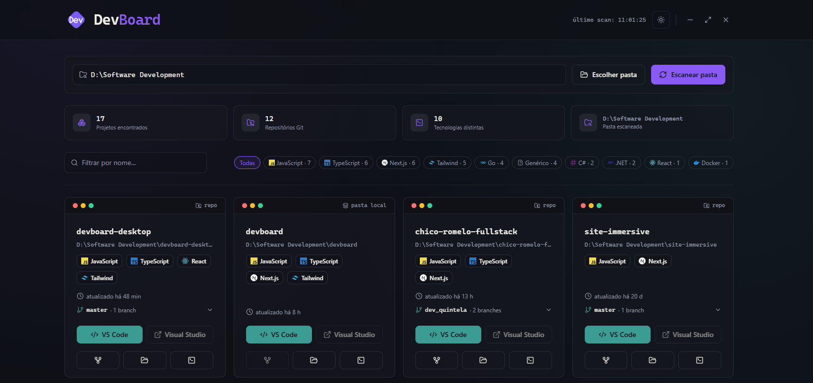
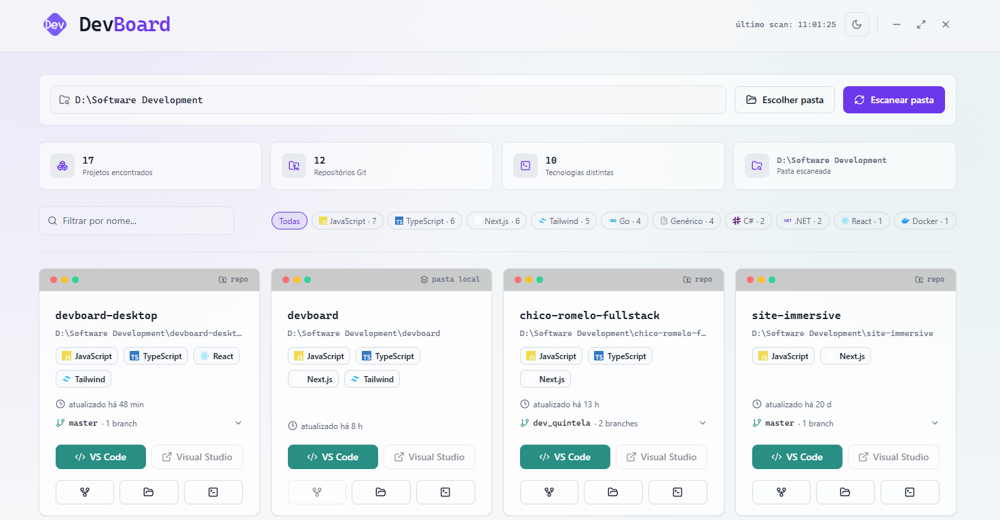

# DevBoard Desktop

Dashboard **desktop nativo para Windows** que escaneia uma pasta do seu PC e mostra cada projeto como um card — tecnologias detectadas, branches do Git e atalhos para abrir no **VS Code**, **Visual Studio**, **Fork**, no **Explorador de Arquivos** ou num **PowerShell** já na pasta certa. Empacotado como um `.exe` instalável, sem precisar de navegador nem de servidor rodando.

Feito com **Electron + React + TypeScript + Vite + Tailwind CSS**, usando `electron-vite` como build tool e `electron-builder` para gerar o instalador.

## Download

[](https://github.com/markintela/devboard-desktop/releases/latest)

Baixe o instalador `.exe` mais recente em **[Releases](https://github.com/markintela/devboard-desktop/releases/latest)** e rode — o instalador deixa escolher a pasta de instalação e cria atalho no Menu Iniciar e na Área de Trabalho.

> O instalador não tem certificado de assinatura de código pago, então o Windows SmartScreen pode avisar "Editor desconhecido/Windows protegeu o computador". Clique em **Mais informações → Executar assim mesmo** pra prosseguir.

## Screenshots

| Dark | Light |
|---|---|
|  |  |

## Como rodar em modo desenvolvimento

Pré-requisitos: [Node.js](https://nodejs.org) 20+, no Windows.

```bash
npm install
npm run dev
```

Isso abre a janela do DevBoard direto, com hot-reload.

## Como gerar o instalador (.exe)

```bash
npm install
npm run build:win
```

Isso compila o processo principal, o preload e a interface (`electron-vite build`) e empacota tudo com `electron-builder`, gerando um instalador **NSIS** em `release/`. O instalador deixa escolher a pasta de instalação e cria atalho na Área de Trabalho e no Menu Iniciar.

Para só empacotar sem gerar o instalador (pasta `release/win-unpacked`, mais rápido pra testar):

```bash
npm run build:dir
```

> Empacotar o instalador `.exe` precisa rodar no Windows — o `electron-builder` gera o NSIS a partir do sistema de destino.

## Distribuição / Releases

Este repositório tem um workflow de GitHub Actions ([.github/workflows/release.yml](.github/workflows/release.yml)) que builda o instalador no Windows e publica como Release automaticamente sempre que uma tag `v*` é enviada:

```bash
git tag v1.0.0
git push origin v1.0.0
```

O instalador gerado (sem certificado de assinatura de código pago) vai disparar o aviso do SmartScreen do Windows ("Editor desconhecido") até acumular reputação — isso é esperado para distribuição gratuita via GitHub Releases.

## Funcionalidades

- **Detecção de tecnologias** por projeto (ver tabela abaixo).
- **Informações de Git** lidas diretamente da pasta `.git` (branch atual, lista de branches, remoto, último commit) — sem depender do binário `git` instalado.
- **Abrir em**: VS Code, Visual Studio (se houver `.sln`), Fork, Explorador de Arquivos, PowerShell (já na pasta do projeto).
- **Lembra a última pasta escaneada** — na primeira vez, pede pra você escolher uma pasta.
- **Tema claro/escuro** com paleta violeta, alternável no botão de sol/lua do cabeçalho.
- **Iniciar com o Windows**: toggle opcional no cabeçalho (desativado por padrão).
- **Janela sem moldura, em tela cheia** (estilo apresentação) — `Esc` sai do fullscreen, `F11` alterna, e há botões próprios de minimizar / reduzir / fechar.

## O que o DevBoard detecta automaticamente

| Categoria | Como é detectado |
|---|---|
| JS/TS, React, Next.js, Vue, Angular, Svelte, Node, Express, NestJS, Tailwind | `package.json` + `tsconfig.json` |
| Python, Django, Flask | `requirements.txt`, `pyproject.toml`, `manage.py` |
| C# / .NET | arquivos `.sln` / `.csproj` |
| Java / Kotlin / Spring | `pom.xml`, `build.gradle` |
| Go | `go.mod` |
| Rust | `Cargo.toml` |
| PHP / Laravel | `composer.json` |
| Ruby / Rails | `Gemfile` |
| Flutter, Swift, C/C++ | `pubspec.yaml`, `.xcodeproj`, `CMakeLists.txt`, etc. |
| Docker | `Dockerfile`, `docker-compose.yml` |
| Git | pasta `.git` lida diretamente pelo processo principal |

## Botões de cada card

- **Escolher pasta**: abre o seletor de pastas nativo do Windows (`dialog.showOpenDialog`).
- **VS Code**: executa `code "<pasta>"`. Precisa que o comando `code` esteja no PATH (`Ctrl+Shift+P` → "Shell Command: Install 'code' command in PATH").
- **Visual Studio**: procura um `.sln` na pasta e abre com a associação de arquivo padrão do Windows. Sem `.sln`, o botão fica desabilitado.
- **Fork**: procura o `Fork.exe` em `%LOCALAPPDATA%\Fork\current` (ou Program Files); se não achar, tenta o comando `fork` do PATH (Preferences → Integration → Install Command Line Tool no Fork). Só habilitado se a pasta for um repositório Git.
- **Explorador de Arquivos**: abre a pasta com `shell.openPath()`.
- **PowerShell**: abre uma janela nova de PowerShell com o diretório de trabalho já na pasta do projeto.

## Estrutura do projeto

```
src/
  main/                       → processo principal (Node.js completo)
    index.ts                  → cria a janela, registra os handlers de IPC
    lib/
      scan.ts                  → escaneia a pasta raiz
      detect-tech.ts           → heurística de detecção de tecnologias
      git.ts                   → leitura manual de .git
      open-editor.ts           → abre VS Code / Visual Studio / Fork / Explorer / PowerShell
      env.ts, types.ts
  preload/
    index.ts                  → contextBridge: expõe window.devboard.*
    api.d.ts                   → tipagem global de window.devboard
  renderer/                   → interface (React + Vite)
    src/
      App.tsx / main.tsx
      hooks/
        use-theme.ts            → estado do tema claro/escuro
      components/
        dashboard.tsx            → estado, busca, filtros, header
        project-card.tsx          → card de cada projeto
        tech-icon.tsx              → ícones por tecnologia
        logo.tsx                   → marca do app (SVG)
        splash-screen.tsx          → tela de carregamento inicial
        theme-toggle.tsx           → botão de sol/lua
        autostart-toggle.tsx       → botão "iniciar com o Windows"
        window-controls.tsx        → minimizar / reduzir / fechar
        ui/                         → componentes shadcn/ui
      lib/
resources/
  icon.ico / icon.png          → ícone do app e do instalador (gerado a partir do logo.tsx)
electron.vite.config.ts
package.json                   → scripts + configuração do electron-builder
```

## Personalização

- Pastas ignoradas no scan: `IGNORE_DIRS` em `src/main/lib/scan.ts`.
- Ícone do instalador: substitua `resources/icon.ico` (multi-resolução, 256×256 recomendado) e `resources/icon.png`.
- Nome/atalho/appId: seção `"build"` em `package.json`.
- Cores/tema: variáveis CSS em `src/renderer/src/index.css` (`:root` = tema claro, `.dark` = tema escuro).
